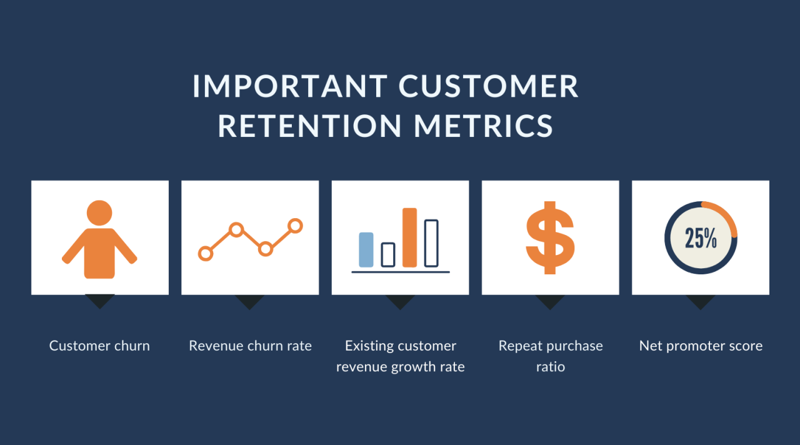
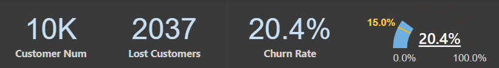
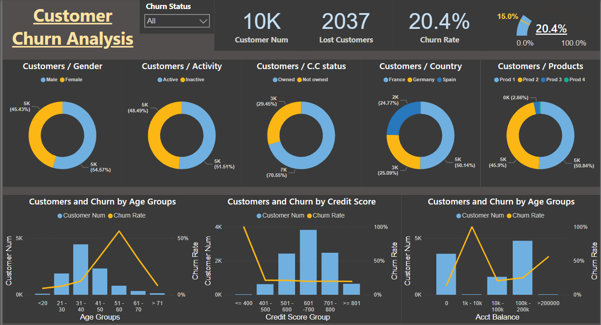

# Customer Churn Analysis Dashboard

## Overview
The **Customer Churn Analysis Dashboard** is an interactive Power BI report that visualizes key metrics related to customer turnover and churn. This dashboard displays various business segments, including demographics, activity status, credit score, and product engagement. It is designed to support data-driven decision-making in improving customer retention strategies.

## Key Features
- **Overall Customer Metrics**:
  - **Customer Num**: Displays the total number of customers.
  
  - **Lost Customers**: Shows the number of customers who have churned.
  - **Churn Rate**: Presents the churn rate as a percentage of the total customer base, along with a mini gauge to highlight current churn performance.

- **Customer Segmentation by Categories**:
  - **Customers / Gender**: Breaks down customer distribution and churn rate by gender.
  - **Customers / Activity**: Shows the proportion of active vs. inactive customers.
  - **Customers / C.C Status**: Displays customer ownership status of a credit card (Owned vs. Not Owned).
  - **Customers / Country**: Segments customers by country (France, Germany, Spain) to assess geographical impact on churn.
  - **Customers / Products**: Illustrates customer distribution across different product categories.

- **Detailed Analysis Charts**:
  - **Customers and Churn by Age Groups**: Analyzes customer numbers and churn rate across different age groups.
  - **Customers and Churn by Credit Score**: Shows how credit score groups relate to customer churn.
  - **Customers and Churn by Account Balance**: Examines the relationship between account balance levels and churn rate.

## How to Interpret the Dashboard
1. **Top Panels (Overall Metrics)**:
   - Use the top-level metrics for a quick overview of customer churn statistics, including total customer count, lost customers, and churn rate.

2. **Category Segmentation**:
   - The donut charts help identify trends within each customer segment (e.g., gender, activity status, product engagement) to better understand which groups are at higher risk of churn.

3. **Detailed Analysis by Key Factors**:
   - The bar and line charts at the bottom offer a deep dive into specific churn factors:
     - **Age Groups**: Analyze churn across different age ranges.
     - **Credit Score**: Understand churn tendencies for customers with varying credit scores.
     - **Account Balance**: Observe how account balance correlates with churn likelihood.

## Usage
This dashboard is intended for use by customer success teams, marketing analysts, and business strategists. It provides insights into customer retention patterns and helps identify areas for improving engagement and reducing churn.

## Data Sources
The dashboard uses data on:
- **Customer Demographics** (e.g., gender, age group, country)
- **Customer Account Details** (e.g., credit score, account balance, product engagement)
- **Activity Status** (active or inactive)

## Future Enhancements
- Adding monthly trends to track changes in customer churn over time.
- Integrating predictive analytics to forecast potential churn risks.
- Allowing drill-down filters for more granular insights by specific customer demographics.

## Screenshot

